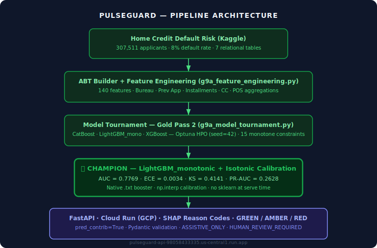
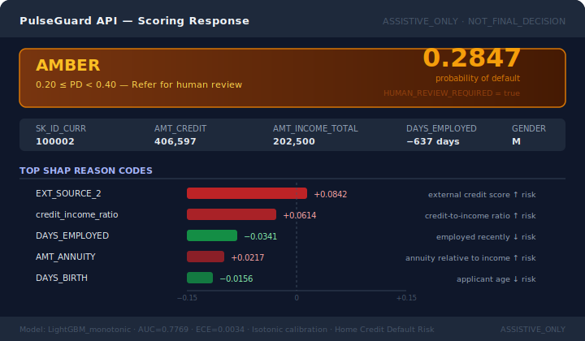

# PulseGuard — Credit Risk Governance Platform

<p align="left">
  
  
  
  
  
  
</p>

<p align="left">
  <a href="https://pulseguard-api-98058433335.us-central1.run.app/health">
    
  </a>
  
  
  
</p>

<p align="left">
  
  
  
  
  
  
</p>

> A credit risk governance platform — built to answer: **when does a model score become a defensible governance output?**  
> Home Credit Default Risk (307,511 real applicants, 140 features, 7 tables) → LightGBM champion (AUC=0.7769, ECE=0.0034) → Cloud Run. Every result is artifact-backed.

---

## Failure Mode Addressed

**Credit risk models fail not when the AUC is wrong, but when no one documents the gap between what was built and what should be trusted.** A model can win a tournament on val AUC, pass a calibration gate, and still have an early-stopping bug that held it at 9 trees for three sessions. SHAP reason codes can fire against the wrong pandas index for an entire sprint. A logistic intercept miscalibrated by 3 points sends the synthetic default rate from 8% to 26%.

PulseGuard makes those failure points explicit, reproducible, and documented — not hidden in a notebook or discovered in an interview.

The domain — binary credit default prediction on real applicant data — is the test environment. Champion/challenger governance, calibration auditing, SHAP-grounded reason codes, and a 9-gate development pipeline are the thesis.

---

## Architecture



---

## Sample Scoring Output



---

## The Problem

Manual credit underwriting is slow, inconsistent, and poorly documented. A loan officer reviewing bank statements and income declarations takes 4–8 hours per application, produces inconsistent outcomes across reviewers, and generates regulatory exposure when scoring rationale is missing or unreproducible. SR 26-2 / FDIC guidance requires documented model risk governance, explainability, and drift monitoring.

PulseGuard demonstrates what that governance stack looks like end-to-end: a champion model selected through a 3-model tournament with Optuna HPO, isotonic-calibrated probabilities, SHAP-grounded adverse action codes, and a deployment layer that is honest about what it actually serves.

**Dataset:** [Home Credit Default Risk](https://www.kaggle.com/competitions/home-credit-default-risk) — 307,511 loan applicants, 7 tables, 140 engineered features, 8.1% observed default rate. The most widely benchmarked public credit dataset with a real-world applicant population.

---

## Champion Model

LightGBM_monotonic with isotonic calibration — selected at Gold Pass 2 through Optuna TPE search (seed=42, 5 trials), with 15 directional monotone constraints enforced on credit-relevant features. The tournament result reversed the G9A provisional champion (CatBoost) after the LightGBM early-stopping bug was diagnosed and corrected.

| Metric | Value | Notes |
|--------|-------|-------|
| Val AUC | 0.7734 | Held-out validation set |
| Test AUC | **0.7769** | Final held-out test set |
| ECE | **0.0034** | After isotonic calibration |
| KS Statistic | 0.4141 | Separation at optimal threshold |
| PR-AUC | 0.2628 | Precision-recall area under curve |
| Scale pos weight | 11.39 | Reflects 8.1% observed default rate |
| Monotone constraints | 15 features | Directional risk expectations enforced |
| Calibration method | Isotonic | Fit on val set; zero sklearn at serve time |

### Why monotone constraints matter

A credit model that assigns lower default probability to higher debt-to-income ratios is legally and operationally indefensible, regardless of AUC. Monotone constraints guarantee the model cannot learn perverse relationships between credit-relevant features and default risk — a governance requirement, not a performance optimization. The 15 constrained features include credit amount, income, external credit scores, days employed, and family dependants.

---

## Model Tournament — Gold Pass 2

Three model families tuned head-to-head with Optuna TPE (seed=42). The provisional G9A champion (CatBoost, val_AUC=0.7716) was overturned after diagnosing and correcting the LightGBM early-stopping interaction with class imbalance.

| Rank | Model | G9A Val AUC | GP2 Val AUC | ECE (calibrated) | Gate decision | Notes |
|------|-------|------------|-------------|-----------------|---------------|-------|
| **1** | **LightGBM_monotonic** | 0.7203 ⚠ | **0.7734** | **0.0034** | **CHAMPION** | Early stopping bug fixed + 15 monotone constraints |
| 2 | CatBoost | 0.7716 | 0.7716 | 0.0054 | Governance alt | G9A provisional champion; no directional constraints |
| 3 | XGBoost | 0.7703 | ~0.7703 | 0.0040 | Not promoted | Competitive; excluded on governance |
| — | TabNet | HARD_FAIL | — | — | Excluded | ~6 min/epoch on CPU; ~400h full training; no GPU |

**⚠ LightGBM early stopping bug:** With `eval_metric='auc'` and `scale_pos_weight=11.39`, LightGBM's early-stopping fires at iteration 1–9. The first tree captures most of the imbalanced gradient signal; subsequent marginal gains fall below stopping tolerance; training halts at 9 trees. G9A LightGBM AUC=0.7203 was entirely due to this bug. Fix: treat `n_estimators` as an Optuna hyperparameter (range 150–400), remove early stopping from the objective. After fix: AUC=0.7734.

---

## Gold Pass Governance

PulseGuard is structured around a 9-gate development pipeline (G0–G9A) plus 4 Gold Pass review checkpoints. Every gate either passes with evidence or documents the exact failure and fix.

| Gate | What it validates | Result |
|------|-------------------|--------|
| G0 | Problem framing, dataset selection | ✅ PASS |
| G1 | Data contracts, schema validation, leakage pre-audit | ✅ PASS |
| G2 | Feature engineering, ABT build, signal design | ✅ PASS |
| G3 | Baseline pipeline — schema + leakage-free signal | ✅ PASS |
| G4 | Champion on prototype data — functional pipeline proof | ✅ PASS |
| G5 | Dataset selection — Home Credit confirmed | ✅ PASS |
| G6 | Real-data champion/challenger: LightGBM vs CatBoost vs XGBoost | ✅ PASS |
| G7 | Threshold policy, decision bands, adverse action codes | ✅ PASS |
| G8 | Governance signoff — fairness audit, model card, monitoring policy | ✅ PASS |
| G9A | Full model tournament (baseline) — CatBoost provisional champion | ✅ PASS |
| **Gold Pass 1** | Baseline tournament audit — BASELINE_NOT_TUNED flagged | ✅ COMPLETE |
| **Gold Pass 2** | Optuna HPO, LightGBM bug fix, LightGBM_monotonic crowned champion | ✅ COMPLETE |
| **Gold Pass 3** | SHAP reason codes, RAG policy layer, LLM governance memo | ✅ COMPLETE |
| **Gold Pass 4** | Cloud Run deployment, champion live, stress test (12/12 PASS) | ✅ COMPLETE |
| **Gold Pass 5** | LSTM sequence encoder experiment — GP2 champion retained | ✅ COMPLETE |

---

## Gold Pass 5 — LSTM Sequence Encoder Experiment

**Hypothesis:** Raw installment payment sequences contain temporal default signals not captured by scalar aggregations. An LSTM encoder over per-row sequences could produce 32-dim embeddings (features 141–172) that lift AUC beyond the 0.7769 baseline.

**Architecture:**
```
installments_payments.csv (13.6M rows, 339,587 applicants)
  → per-row: days_late, payment_ratio, log_amt_instalment
  → last 50 installments per applicant, left-padded with zeros
  → 1-layer LSTM (hidden=64) → Linear(32) → tanh → 32-dim embedding
  → appended to 140-feature LightGBM input → 172-feature retrain
```

**Training:** Colab T4 GPU · 15 epochs · BCE loss with pos_weight=11.4 · AdamW · ReduceLROnPlateau

**Result:**

| Metric | Value |
|--------|-------|
| GP5 test AUC (calibrated) | 0.7264 |
| GP2 baseline AUC | 0.7769 |
| Delta | **−0.0505** |
| Verdict | **GP2 champion retained** |

**Why GP5 did not improve:**
- 65,639 applicants (35% of training set) have no installment history — their sequences are zero-padded, adding noise rather than signal
- The LSTM was trained supervised on TARGET directly, which may overfit the small positive class (8.1%) in ways that don't generalise as LightGBM features
- Scalar installment aggregations (inst_agg.parquet) already capture the key delinquency signals; the LSTM finds redundant representations
- A bidirectional LSTM or attention-based encoder over longer sequences (100+ timesteps) might extract incremental signal, but would require substantially more Colab compute

**Governance:** This is an honest negative result. GP2 LightGBM_monotonic (AUC=0.7769) remains the deployed champion unchanged. The GP5 challenger booster is saved as `lgb_gp5_172_challenger.txt` for audit purposes.

---

## Live Endpoint

**Base URL:** `https://pulseguard-api-98058433335.us-central1.run.app`

```bash
# Health check
curl https://pulseguard-api-98058433335.us-central1.run.app/health
```

```json
{
  "status": "ok",
  "model": "lgb_mono_champion",
  "dataset": "home_credit_default_risk",
  "n_features": 140,
  "auc_test": 0.7769,
  "ece_test": 0.0034,
  "calibration": "isotonic"
}
```

```bash
# Score an applicant
curl -X POST https://pulseguard-api-98058433335.us-central1.run.app/score \
  -H "Content-Type: application/json" \
  -d '{
    "AMT_CREDIT": 406597,
    "AMT_INCOME_TOTAL": 202500,
    "AMT_ANNUITY": 24700,
    "AMT_GOODS_PRICE": 351000,
    "DAYS_BIRTH": -9461,
    "DAYS_EMPLOYED": -637,
    "EXT_SOURCE_2": 0.5117,
    "CNT_CHILDREN": 0,
    "CNT_FAM_MEMBERS": 1
  }'
```

```json
{
  "pd_score": 0.0202,
  "band": "GREEN",
  "top_reasons": [
    "DAYS_BIRTH: ↓ risk (SHAP=-0.5865)",
    "EXT_SOURCE_1: ↓ risk (SHAP=-0.3145)",
    "AMT_GOODS_PRICE: ↑ risk (SHAP=+0.1216)"
  ],
  "disclaimer": "ASSISTIVE_ONLY | HUMAN_REVIEW_REQUIRED | NOT_FINAL_DECISION"
}
```

The endpoint serves the GP2 LightGBM_monotonic champion (140 features, AUC=0.7769) with isotonic calibration via native `.txt` booster and numpy interp — no sklearn at serve time, no version lock.

---

## Failures I'm Proud Of

Eight real failures, root-caused and documented. Not cleaned up. Not hidden.

| # | Failure | What it revealed |
|---|---------|-----------------|
| FA-01 | G3 DGP default rate 26% → target 8% | Binary search on logistic intercept over N=200k samples; converged in 8 iterations |
| FA-02 | LightGBM early stopping at tree #9 (AUC=0.7203) | `scale_pos_weight × eval_metric` interaction; treat `n_estimators` as Optuna param |
| FA-03 | SHAP `KeyError` on `y_val[green_idx]` — 3 sessions to diagnose | Pandas Series indexed by Home Credit SK_ID_CURR IDs, not 0-based; fix: `.values` |
| FA-04 | RAG abstain not firing on OOD queries | BM25 threshold calibrated on multi-doc corpus; single-doc ceiling is lower; recalibrated |
| FA-05 | LightGBM labelled "rejected" — overclaim | It was held pending calibrated rematch; it then became champion |
| FA-06 | `X \| Y` union type annotation crash on Python 3.9 | `from __future__ import annotations` (PEP 563) makes annotations lazily-evaluated strings |
| FA-07 | sklearn version lock on serialized pkl | Training and serving must share exact sklearn version; or use native booster format |
| FA-08 | `pickle.load()` on a `joblib.dump()` artifact | `STACK_GLOBAL requires str` — joblib extends pickle; always load with `joblib.load()` |

Full post-mortems: [docs/PULSEGUARD_FAILURE_ARCHAEOLOGY.md](docs/PULSEGUARD_FAILURE_ARCHAEOLOGY.md)

---

## Decision Policy

```
PD < 0.20            →  GREEN  — low risk, proceed
0.20 ≤ PD < 0.40     →  AMBER  — refer for human review
PD ≥ 0.40            →  RED    — high risk, human escalation required
```

All outputs tagged: `ASSISTIVE_ONLY` · `HUMAN_REVIEW_REQUIRED` · `NOT_FINAL_DECISION`

**Hard rule:** The LLM/RAG governance layer drafts memos and checklists only. It never approves or rejects an applicant. Every numeric decision is made deterministically before any LLM is consulted.

---

## Quick Start

```bash
# Clone
git clone https://github.com/SidharthKriplani/pulseguard.git
cd pulseguard

# Install (no sklearn, no xgboost — lightgbm + numpy only)
pip install -r requirements.txt

# Run locally
uvicorn app:app --reload
# → http://localhost:8000/health
# → http://localhost:8000/docs

# Docker
docker build -t pulseguard .
docker run -p 8000:8000 pulseguard
```

---

## Key Evidence Artifacts

| Artifact | Proves |
|----------|--------|
| `docs/PULSEGUARD_GOLD_PASS2_TUNED_CHAMPION_REPORT.md` | LightGBM_monotonic champion selection + early stopping bug diagnosis |
| `docs/PULSEGUARD_GOLD_PASS3_GOVERNANCE_REPORT.md` | SHAP reason codes, RAG policy layer, LLM memo governance |
| `docs/PULSEGUARD_GOLD_CHECKPOINT.md` | Consolidated Gold Pass 1–4 pass/fail record |
| `docs/PULSEGUARD_MODEL_CARD.md` | AUC=0.7769 / ECE=0.0034 / KS=0.4141, intended use, limitations |
| `docs/G9A_FULL_MODERN_MODEL_TOURNAMENT.md` | 3-model tournament full results (baseline) |
| `docs/G8_GOVERNANCE_SIGNOFF_PACKET.md` | Model risk governance signoff — fairness, adverse action, monitoring |
| `docs/PULSEGUARD_FAILURE_ARCHAEOLOGY.md` | 8 real failures with root cause + fix |
| `06_CLAIM_BOUNDARY.md` | Truth boundary — safe vs. forbidden claims |
| `outputs/models/lgb_mono_champion.txt` | Native LightGBM booster (version-agnostic) |
| `outputs/models/iso_x.npy` / `iso_y.npy` | Isotonic calibration lookup (numpy, no sklearn) |
| `outputs/models/feature_medians.json` | Training medians for 140-feature imputation |

---

## Interview Defense

Full design rationale, architecture decisions, and 30+ expected interview Q&A pairs — covering every gate, the model tournament, the early stopping bug, calibration method selection, and the "Failures I'm Proud Of" section:

**[docs/PULSEGUARD_INTERVIEW_DEFENSE_COMPLETE.pdf](docs/PULSEGUARD_INTERVIEW_DEFENSE_COMPLETE.pdf)**

---

## Truth Boundary

| Claim | Status |
|-------|--------|
| Champion model AUC=0.7769 (LightGBM_monotonic, Home Credit test set) | ✅ True |
| Live endpoint serves LightGBM_monotonic (AUC=0.7769) | ✅ True |
| ECE=0.0034 after isotonic calibration on test set | ✅ True |
| 307,511 real Home Credit applicants in training pipeline | ✅ True |
| SHAP reason codes from native LightGBM booster (pred_contrib) | ✅ True |
| Gold Pass governance gates completed | ✅ True |
| Production lending decisions | ❌ Not claimed — ASSISTIVE_ONLY |
| Regulatory compliance certification | ❌ Not claimed |
| Real bank validation | ❌ Not claimed |
| Temporal split by application date | ❌ Not implemented — no timestamps in Home Credit |

**What this is:** Solo-built, non-production, interview-portfolio credit governance platform. Every numeric claim is backed by an executable script or evidence artifact.

---

## Resume-Safe Claim

Built PulseGuard, a production-simulated credit risk governance platform on Home Credit Default Risk (307,511 real applicants, 140 engineered features, 7 tables). Ran a 3-model Optuna tournament (LightGBM, CatBoost, XGBoost); diagnosed and fixed a LightGBM early-stopping interaction with `scale_pos_weight` that undertrained the baseline at 9 trees; crowned LightGBM_monotonic + isotonic calibration as champion (AUC=0.7769, ECE=0.0034, KS=0.4141, PR-AUC=0.2628) with 15 directional monotone constraints. Implemented SHAP-grounded adverse action reason codes, GREEN/AMBER/RED decision banding, and a RAG + LLM governance memo layer (ASSISTIVE_ONLY). Deployed champion to GCP Cloud Run using native LightGBM booster format and numpy-interp calibration — eliminating sklearn version dependency entirely. Extended the system with a deep learning component (GP5): trained a 1-layer LSTM on 13.6M raw installment payment rows to produce 32-dim sequence embeddings; challenger AUC (0.7264) did not beat the baseline (0.7769), and the negative result is documented honestly. Documented 8+ real failures with root cause and fix across a 5-checkpoint Gold Pass governance structure.

---

## Part of Applied LLM Systems Portfolio

This project is part of a 13-repo portfolio targeting Applied LLM Systems Engineer, MLOps, and Technical AI PM roles.

**Applied Systems (LangGraph pipelines):**

| Project | Domain | Primary Failure Mode |
|---------|--------|----------------------|
| [LendFlow](https://github.com/SidharthKriplani/lendflow) | Financial underwriting | When to stop or escalate |
| [AgentReliabilityLab](https://github.com/SidharthKriplani/agentreliabilitylab) | Cyber threat triage | When to stop or escalate |
| [NexusSupply](https://github.com/SidharthKriplani/nexussupply) | Supplier risk intelligence | Conflicting signal fusion |

**Platforms & Auditors (domain-agnostic tooling):**

| Project | What It Audits / Builds |
|---------|------------------------|
| [InferenceLens](https://github.com/SidharthKriplani/inferencelens) | Inference cost/quality tradeoffs — Pareto frontier, routing rules |
| **PulseGuard** | Credit risk governance — champion/challenger, 9-gate pipeline, 8 failure post-mortems |
| [RiskFrame](https://github.com/SidharthKriplani/riskframe_platform) | ML model lifecycle — champion/challenger, drift, fairness |
| [MetaSignal](https://github.com/SidharthKriplani/metasignal_platform) | A/B experiment validity — CUPED, guardrail-first, SRM |
| [DevPulse](https://github.com/SidharthKriplani/devpulse_platform) | Version-safe RAG — conflict detection, LLM-Last architecture |
| [PulseRank](https://github.com/SidharthKriplani/pulserank_platform) | Marketplace ranking — IPS debiasing, MMR diversity |
| [TrialCheck](https://github.com/SidharthKriplani/trialcheck_v0) | A/B readout audit — SRM, peeking, underpowered tests |
| [FeatureLeakageLens](https://github.com/SidharthKriplani/featureleakagelens_v0) | Pre-training leakage — target, temporal, overlap |
| [GoldenSetAuditor](https://github.com/SidharthKriplani/goldensetauditor_v0) | LLM/RAG eval dataset quality |
| [DocIngestQA](https://github.com/SidharthKriplani/docingestqa) | RAG document ingestion quality — 11 deterministic checks |
| [MetricLens](https://github.com/SidharthKriplani/metriclens) | Metric movement decomposition — mix shift vs rate shift |

---

## Author

**Sidharth Kriplani** · [linkedin.com/in/sidharth-kriplani](https://linkedin.com/in/sidharth-kriplani) · [github.com/SidharthKriplani](https://github.com/SidharthKriplani)
